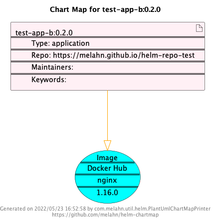
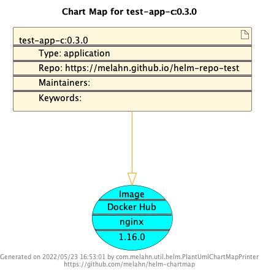
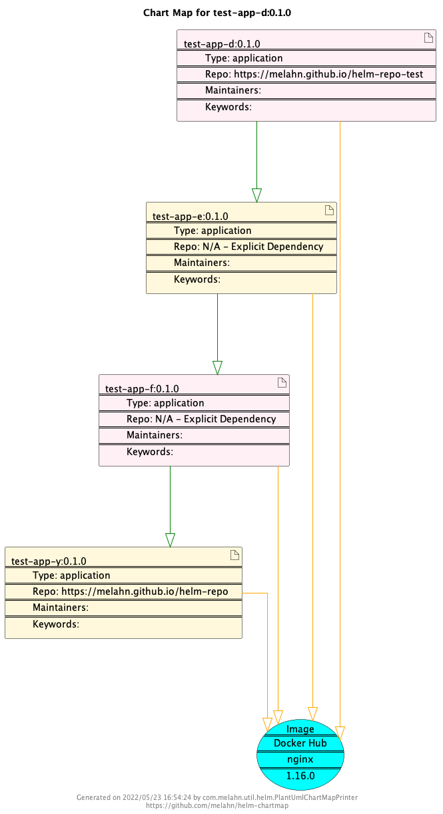
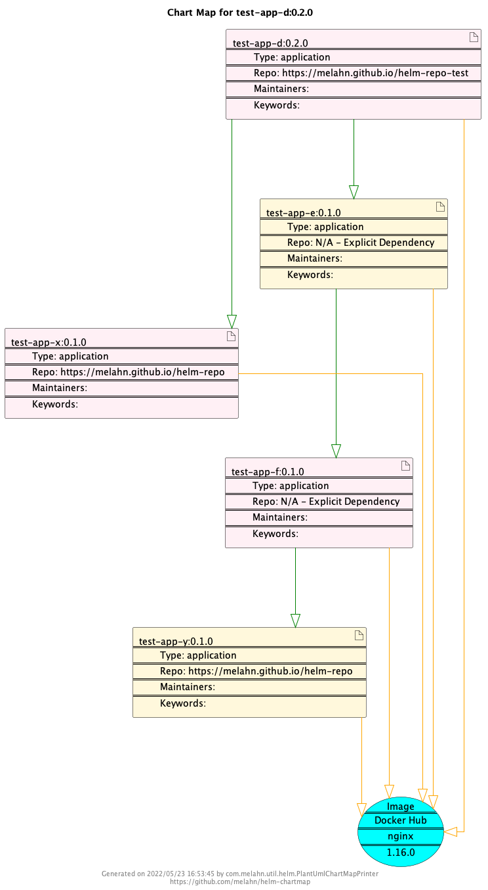

# helm-repo-test

## Overview 

A repo to host a helm charts repo for testing helm apps like [helm-chartmap](https://github.com/melahn/helm-chartmap) and [helm-chartmap-generator](https://github.com/melahn/helm-chartmap-generator).

## Usage

Add this to your helm repo list, like this ...

```
helm repo add my-test-repo https://melahn.github.io/helm-repo-test
```

Then you can get any of the charts in the repo using helm commands.

## Design

There are five helm charts in this repo, each with a different characteristic to allow testing variations in test tools.

Here are generated Chart Maps generated with [Helm Chart Map](https://github.com/melahn/helm-chartmap) to illustrate the shape of each of the helm charts.  In the case of test-app-g, this chart is deliberately created with an error in which it includes non-existent dynamic chart to allow testing that condition. So a Chart Map could not be generated for that case.  A text description is provided instead.

- test-app-a
  
- test-app-b
  
  
- test-app-c
  
  
  
- test-app-d
  
  
- test-app-g
  - version 0.1.0
    - test-app-h
      - version 0.1.0
        - test-app-i
          - version 0.1.0
          - depends on https://melahn.github.io/helm-repo no-chart-here (the chart does not exist)

## Build

The repo is entirely build from scratch by running the [GitHub Build Action](https://github.com/melahn/helm-repo-test/blob/main/.github/workflows/create-helm-repo.yml)


